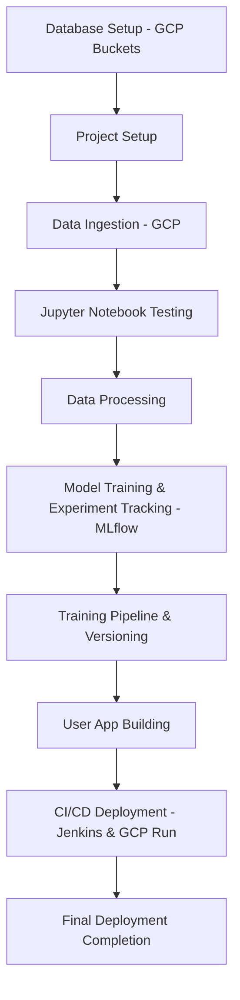

# 🚀 HOTEL RESERVATION PREDICTION - MLOps WORKFLOW


---

## 🌟 Project Overview
This project predicts **hotel reservation cancellations** using **MLOps** principles, integrating **Google Cloud Platform (GCP), MLflow, Docker, Jenkins, and CI/CD** for automated model training and deployment.

🔗 **Live Demo:** [Hotel Reservation Prediction](https://ml-project-730063488438.us-central1.run.app)

---

## 📌 Workflow Diagram


---

## 📂 Project Structure
```plaintext
HOTEL RESERVATION PREDICTION
│── artifacts
│   ├── models
│   │   ├── Igbm_model.pkl
│   ├── processed
│   │   ├── processed_test.csv
│   │   ├── processed_train.csv
│   ├── raw
│       ├── raw.csv
│       ├── test.csv
│       ├── train.csv
│── config
│   ├── config.yaml
│   ├── model_params.py
│   ├── paths_config.py
│── custom_jenkins
│   ├── Dockerfile
│── logs
│── mlruns
│── notebook
│   ├── notebook.ipynb
│── pipeline
│   ├── training_pipeline.py
│── src
│   ├── data_ingestion.py
│   ├── data_preprocessing.py
│   ├── model_training.py
│── templates
│   ├── index.html
│── utils
│   ├── common_functions.py
│── application.py
│── Dockerfile
│── Jenkinsfile
│── requirements.txt
│── setup.py
```

---

## 🚀 Step-by-Step Implementation
### **1️⃣ Database Setup with GCP Buckets**
- Create a Google Cloud Storage Bucket to store **raw data** and **processed data**.
- Enable **Cloud Storage API** and set up authentication using a service account.

### **2️⃣ Project Setup**
- Initialize a **Python Virtual Environment**.
- Install dependencies:
  ```sh
  pip install -r requirements.txt
  ```
- Define project structure.

### **3️⃣ Data Ingestion with GCP**
- Fetch raw data from GCP Bucket.
- Store it in the `artifacts/raw` directory.

### **4️⃣ Jupyter Notebook Testing**
- Run `notebook/notebook.ipynb` for Exploratory Data Analysis (EDA) and feature engineering.

### **5️⃣ Data Processing**
- Clean and preprocess the data (`src/data_preprocessing.py`).
- Store processed data in `artifacts/processed/`.

### **6️⃣ Model Training & Experiment Tracking (MLflow)**
- Train models using `src/model_training.py`.
- Log experiments in **MLflow** (`mlruns/`).
- Save the best model to `artifacts/models/`.

### **7️⃣ Training Pipeline & Versioning**
- Automate data ingestion, training, and model selection in `pipeline/training_pipeline.py`.

### **8️⃣ User App Building**
- Develop a web interface (`templates/index.html`, `application.py`).
- Use **Flask** for API interaction.

### **9️⃣ CI/CD Deployment using Jenkins & Google Cloud Run**
#### **1️⃣ Set up Jenkins Container (Docker in Docker)**
```sh
docker run -d --name jenkins -p 8080:8080 -v /var/run/docker.sock:/var/run/docker.sock jenkins/jenkins
```
#### **2️⃣ Integrate with GitHub**
- Set up Jenkins webhook for **automatic builds**.

#### **3️⃣ Dockerize the Project**
- Create a `Dockerfile`:
  ```dockerfile
  FROM python:3.9
  WORKDIR /app
  COPY . .
  RUN pip install -r requirements.txt
  CMD ["python", "application.py"]
  ```
- Build Docker image:
  ```sh
  docker build -t hotel-reservation-predictor .
  ```

#### **4️⃣ Create Virtual Environment in Jenkins**
```sh
python -m venv venv
source venv/bin/activate
pip install -r requirements.txt
```

#### **5️⃣ Build & Push Docker Image to GCR**
```sh
gcloud auth configure-docker
export PROJECT_ID=$(gcloud config get-value project)
docker tag hotel-reservation-predictor gcr.io/$PROJECT_ID/hotel-reservation-predictor
docker push gcr.io/$PROJECT_ID/hotel-reservation-predictor
```

#### **6️⃣ Deploy to Google Cloud Run**
```sh
gcloud run deploy hotel-reservation-predictor \
    --image gcr.io/$PROJECT_ID/hotel-reservation-predictor \
    --platform managed \
    --region us-central1 \
    --allow-unauthenticated
```

#### **7️⃣ Final Deployment Completion!**
🔗 **Live Demo:** [Hotel Reservation Prediction](https://ml-project-730063488438.us-central1.run.app)

---

## 📜 Jenkinsfile for Automation
```groovy
pipeline {
    agent any

    environment {
        VENV_DIR = 'venv'
        GCP_PROJECT = "peppy-glyph-454715-c4"
        GCLOUD_PATH = "/var/jenkins_home/google-cloud-sdk/bin"
    }

    stages {
        stage('Cloning Github repo to Jenkins') {
            steps {
                script {
                    echo 'Cloning Github repo to Jenkins..........'
                    checkout scmGit(branches: [[name: '*/main']], extensions: [], userRemoteConfigs: [[credentialsId: 'github-token', url: 'https://github.com/jayesh-patil123/Hotel_Reservation_Prediction.git']])
                }
            }
        }

        stage('Setting up our Virtual Environment and Installing dependencies') {
            steps {
                script {
                    echo 'Setting up our Virtual Environment and Installing dependencies..........'
                    sh '''
                    # Use bash explicitly
                    /bin/bash -c "
                    python3 -m venv ${VENV_DIR}
                    source ${VENV_DIR}/bin/activate
                    pip install --upgrade pip
                    pip install -e .
                    "
                    '''
                }
            }
        }

        stage('Building and Pushing Docker Image to GCR') {
            steps {
                withCredentials([file(credentialsId: 'gcp-key', variable: 'GOOGLE_APPLICATION_CREDENTIALS')]) {
                    script {
                        echo 'Building and Pushing Docker Image to GCR............'
                        sh '''
                        /bin/bash -c "
                        export PATH=$PATH:${GCLOUD_PATH}
                        gcloud auth activate-service-account --key-file=${GOOGLE_APPLICATION_CREDENTIALS}
                        gcloud config set project ${GCP_PROJECT}
                        gcloud auth configure-docker --quiet
                        docker build --no-cache -t gcr.io/${GCP_PROJECT}/ml-project:latest .
                        docker push gcr.io/${GCP_PROJECT}/ml-project:latest
                        "
                        '''
                    }
                }
            }
        }

        stage('Deploy to Google Cloud Run') {
            steps {
                withCredentials([file(credentialsId: 'gcp-key', variable: 'GOOGLE_APPLICATION_CREDENTIALS')]) {
                    script {
                        echo 'Deploy to Google Cloud Run............'
                        sh '''
                        /bin/bash -c "
                        export PATH=$PATH:${GCLOUD_PATH}
                        gcloud auth activate-service-account --key-file=${GOOGLE_APPLICATION_CREDENTIALS}
                        gcloud config set project ${GCP_PROJECT}
                        gcloud run deploy ml-project \
                            --image=gcr.io/${GCP_PROJECT}/ml-project:latest \
                            --platform=managed \
                            --region=us-central1 \
                            --allow-unauthenticated
                        "
                        '''
                    }
                }
            }
        }
    }
}
```

---

## ✨ Conclusion
This project successfully implements **MLOps**, automating **data ingestion, model training, experiment tracking, and deployment** using **Google Cloud Platform, Jenkins, Docker, and MLflow**.

✅ **Fully Automated Deployment** 🔥
✅ **Robust & Scalable Architecture** 💡
✅ **Live Prediction Model in Action** 🚀
